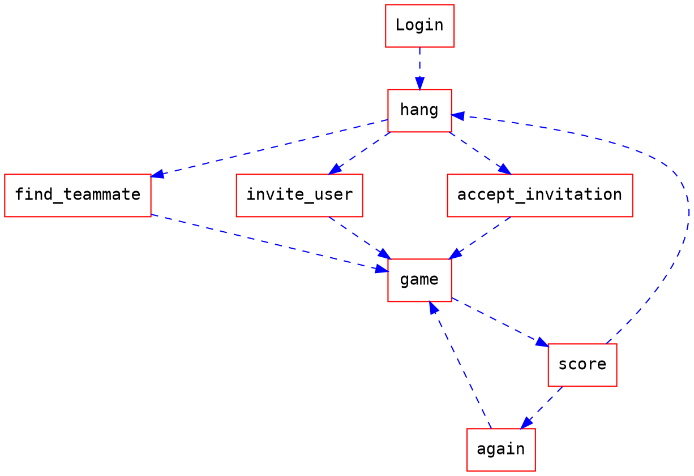

# CNL2018-Teammate.net
### Teammate.net for NTU CNL2018 Spring

## Scenario
- Find teammate on net

### User Process


## Target Game
- zombsroyale.io

## Chrome extension
- push notification
- catching game feature
- login
- Get request /notification ?

## Backend normal
- History public score & history hidden score

- Last 10 game record
- Game room management
    - Check whether the room is empty or not
    
- Database Structure (6/6 updated)
    ```
    - lineupPool
        - uid / timestamp(tick)
    - gameData
        - id(AI) / uid / record
    - uid2room
        - (paired users)
        - uid / roomcode
    ```

- API

    - Get /lineup/:uid
        - return: success
            ```
            {
                'result': success,
                'room':roomcode
                
            }
            ```
        - return: fail
            ```
            {
                'result': fail
            }
            ```

    - Post /record/:uid
        - content
            ```
            {
                'record': game_record(string)
                
            }
            ```
        - return
            ```
            {
                'result': success:fail
                
            }
            ```

    - Database
        - user score
        - user hidden score
        - friend list
        - last 10 game score

## Backend recommendation

